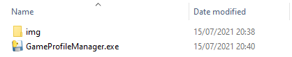
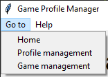

### Game Profile Manager

The solution to creating multiple profiles or playthroughs of single player games.

As a PC gamer sharing a PC with siblings, I found there are a ton of games out there that do not support profiles or save slots. Super annoying when you have other users on the same device who have started a save. You'd normally find clicking on 'New Game' would pull up prompts like 'All previous progress will be lost when creating a new game. Do you want to continue', sigh!

Originally developed in 2009 for the sole purpose of handling profiles for Need for Speed: Shift. It became apparent this app would need to support any number of games and profiles. So here we are with my first GitHub version to share with the gaming community.

### Installation

Unzip Game Profile Manager to a location of choice. For initial release i would suggestion placing it outside of program files.

Ensure the folder structure is as follows:  
Game Profile Manager  
&nbsp;&nbsp;&nbsp;> img  
&nbsp;&nbsp;&nbsp;> GameProfileManager.exe

  
### Startup

On startup Game Profile Manager will provide a prompt to say you do not have any profiles or games added. This is normal of course. Once you start added profiles and games these will be saved into the 'resources/' folder along with save game files once you start playing.

### Navigation

The top menu bar is where users can navigate to different app features.  

  
<ul>
<li><strong>Home</strong> - this is the default page of the app. Here you can select your game and the profile and run the game.</li>
<li><strong>Profile management</strong> - here is where you can add and delete profiles. Note, deleting a profile will not delete the save games in the 'resources/' folder. You never know when you might need that save again.</li>
<li><strong>Game management</strong> - here is where you can add and delete games. Note, deleting doesn't uninstall the game. It simply breaks Gampe Profile Managers tie to the game. This will also not delete any saved data ino the 'resources/' folder</li>
</ul>

### Adding a profile

### Dependencies

- [pylnk3](https://github.com/strayge/pylnk)
- [Pillow](https://pillow.readthedocs.io/en/stable/)