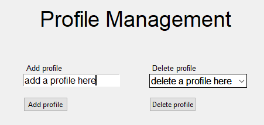
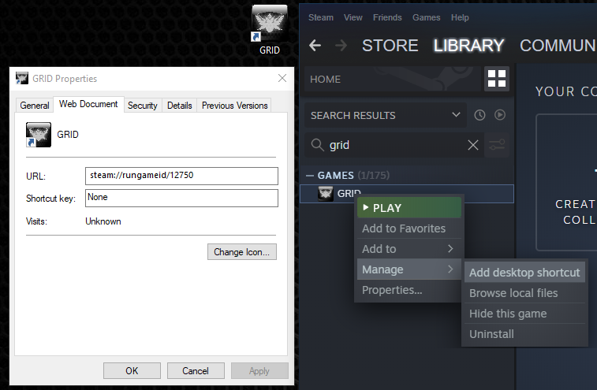
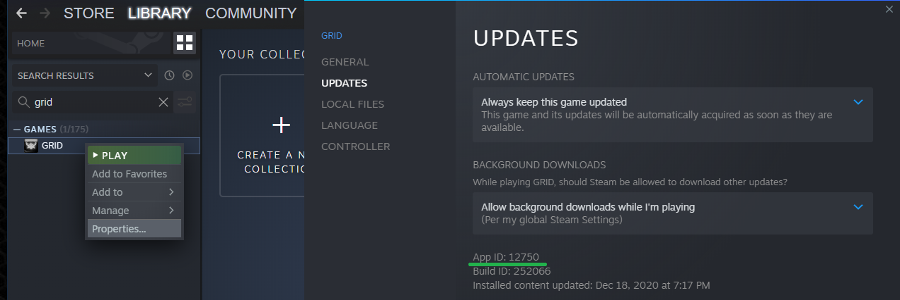
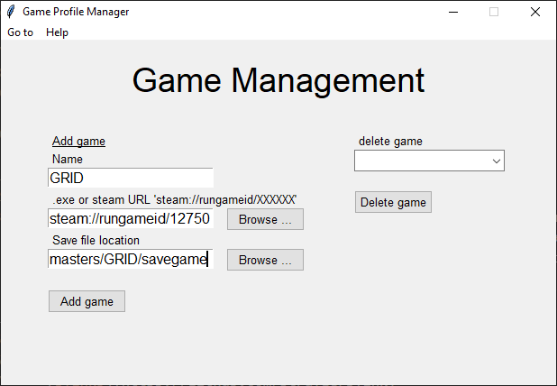

# Game Profile Manager

The solution to creating multiple profiles or playthroughs for single player games.

As a PC gamer sharing a PC with siblings, I found there are a ton of games out there that do not support profiles or save slots. This is problematic when you have multiple users on the same device. You would normally find starting a 'New Game' in such games would pull up prompts like 'All previous progress will be lost. Do you want to continue', sigh!

Originally developed in 2009 for the sole purpose of handling profiles for Need for Speed: Shift. It became apparent this app would need to support any number of games and profiles. So here we are with my first GitHub version to share with the gaming community.

## Note

This application manipulates files and folder including copying and, in some cases, deleting files and folders. I do not take responsibility for any loss of data. Please always keep a backup of your save files at regular intervals.

It is also worth mentioning that you may need to turn off steam cloud sync. Otherwise it can force the reloading of cloud saves thus undoing the efforts of Game Profile Manager.

## Installation

Unzip Game Profile Manager to a location of your choice. For initial release I would suggestion placing it outside of the program files folders.

Ensure the folder structure is as follows:  
Game Profile Manager  
&nbsp;&nbsp;&nbsp;> img  
&nbsp;&nbsp;&nbsp;> GameProfileManager.exe

  

## Start up

On start up Game Profile Manager will provide a prompt to say you do not have any profiles or games added. Once you start added profiles and games these will be saved into the 'resources/' folder along with save game files once you start playing.

## Navigation

The top menu bar is where users can navigate to different app features.  

<ul>
<li /><strong>Home</strong> - this is the default page of the app. Here you can select your game and the profile and run the game.
<li /><strong>Profile management</strong> - here is where you can add and delete profiles. Note, deleting a profile will not delete the save games in the 'resources/' folder. You never know when you might need those save files again.
<li /><strong>Game management</strong> - here is where you can add and delete games. Note, deleting doesn't uninstall the game. It simply breaks Game Profile Manager's tie to the game. This will also not delete any saved data in the 'resources/' folder.
</ul>

## Adding/ deleting a profile

A profile can be added on the left side of the Profile management screen. You can also delete profiles on the right side of the screen.

## Adding/ deleting a game

Adding a game is a bit more involved but it's worth it. On the left of the game page you will see 3 boxes:

<ul>
<li /><strong>Name</strong> - this will be the name of the game. You can name the games whatever you like it doesn't need to match the actual games name.
<li /><strong>.exe or steam URL 'steam://rungameid/XXXXXX'</strong> - here is where you can add the games .exe path (advised for non-steam games) or add the steam URL of the game. More about finding the steam URL for a given game below.
<li /><strong>Save location</strong> - this is where the game of your choice is currently storing its saved data. Every game has a different save folder, so we'll need to find it's location. Google is your friend here, but I aim to provide this information on a wiki page for ease of use at some point. It won't list every game, but it will be a start.
</ul>

### Launching a game

On the homepage, choose the profile and game and hit play game. Simple!

## Finding the steam URL of a game

Game Profile Manager supports the use of steam game URLs. Steam shortcuts do not contain paths to exact files but instead contain a steam URL link. When triggered steam kicks in and launches the game. Let us look at 2 ways to get this URL.

<ol>
<li/><strong>Creating a desktop shortcut</strong> - find the steam game of choice in your steam library. Right click and select Manage > Add desktop shortcut. Right click the desktop icon and select Properties. The steam URL will be location in the 'URL' box of the 'Web Document' tab.

<li/><strong>Finding the steam game id</strong> - find the steam game of choice in your steam library. Right click and select 'Properties...'. In the app properties window select the 'UPDATES' tab and you will see the app id. When adding this app id to Game Profile Manager you will need to prefix the app id with the full steam URL 'steam://rungameid/APP_ID_HERE'.

</ol>

## Adding an example game (Race Driver: Grid (2008))

Let's run through a worked example of using the app from start to finish with Race Driver: Grid. Although this game supports steam family sharing it does not link save games to the active steam user. So even though multiple steam users can play this game, if on the same device, they will share the same save game data. Not ideal.

### Adding Race Driver: Grid (2008) to Game Profile Manager

To go Game Management via the menu bar then enter the following information.  
<ul>
<li />Name: GRID
<li />.exe or steam URL 'steam://rungameid/XXXXXX': steam://rungameid/12750
<li />Save file location: C:\Users\user\Documents\Codemasters\GRID\savegame
<li />Click 'Add game' 
</ul>

That's it. Now add a profile (Profile A) and play the game. When a new profile (Profile B) is selected you will notice that Profile B will have their own save files created.

## Source and contributors
img > copy_icon.png - Provided by [flaticon.com](https://www.flaticon.com/). Contributor: [Catalin Fertu](https://catalinfertu.com/)

## Application dependencies

- [pylnk3](https://github.com/strayge/pylnk)
- [Pillow](https://pillow.readthedocs.io/en/stable/)
